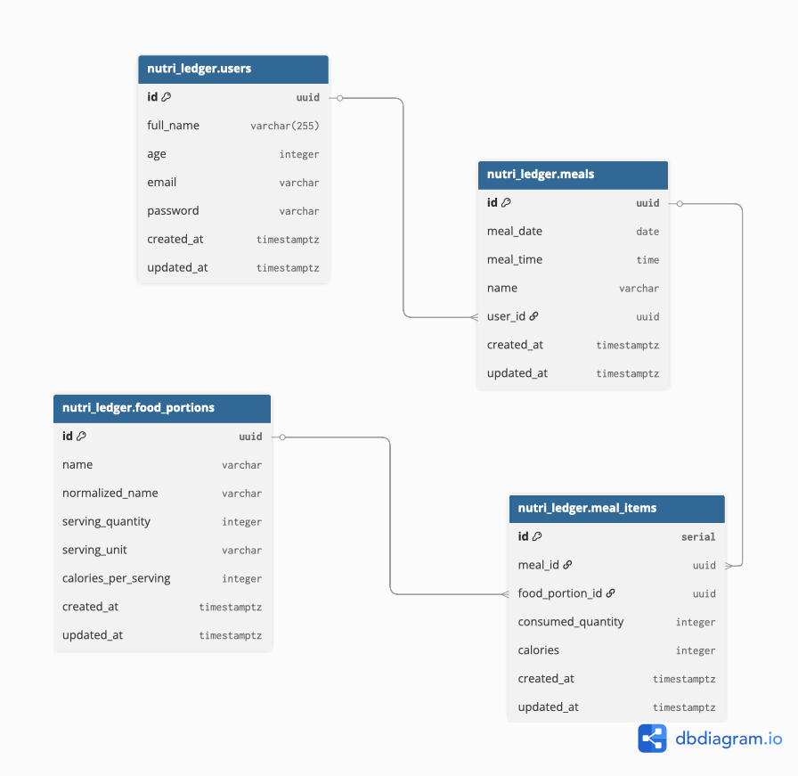

# 📦 Liquibase Migration Project

This repository contains the database migrations for the [`nutri-ledger-api`](https://github.com/Personal-Project-Ideas/nutri-ledger-api) project using [Liquibase](https://www.liquibase.org/).

---

## 🚀 Project Structure

```.
├── dev/
│   └── docker-compose.yaml
├── prd/
│   └── docker-compose.yaml
├── migrations/
│   └── changelog.yaml
├── .env
├── .env.example
├── Makefile
└── README.md
```

---

## ⚙️ Requirements

- Docker + Docker Compose
- Make
- `.env` file at the root (based on `.env.example`)

---

## 📄 Environment Variables (`.env`)

```env
ENV=development
POSTGRES_USER=admin
POSTGRES_PASSWORD=your_password
POSTGRES_DB=trainingLog
POSTGRES_HOST=localhost
POSTGRES_PORT=5432
```

All commands and services depend on these variables. Make sure your .env is correctly configured before running any operation.

## 🧰 Makefile Commands

Run these commands from the root directory:

- ▶️ Apply migrations (development)

  ```sh
     make liquibase-update-dev
  ```

- ↩️ Roll back last migration (development)

  ```sh
     make liquibase-rollback-dev count=1
  ```

- 📄 Create a new migration file

  ```sh
     make new-migration name=create_users_table
  ```

This will create a file inside migrations/ with the current timestamp and the given name, like 20250726174500_create_users_table.sql.
🐳 Docker Compose

## 🧪 Development (dev/docker-compose.yaml)

- Brings up Postgres and Liquibase
- Uses the shared .env file from the project root

## 🚀 Production (prd/docker-compose.yaml)

- Only runs the Liquibase container
- Assumes the database is managed externally (e.g. Supabase)

## ✅ Quick Start

1. Copy .env.example to .env
2. Fill in your database credentials
3. Run `make liquibase-update-dev` to apply migrations
4. Check the database to verify schema creation

### 🔗 Related

API repository: nutri-ledger-api

#### 📝 Notes

Use the new-migration command to generate migration files manually.
Make sure your Liquibase changes are idempotent and safe to rerun.


